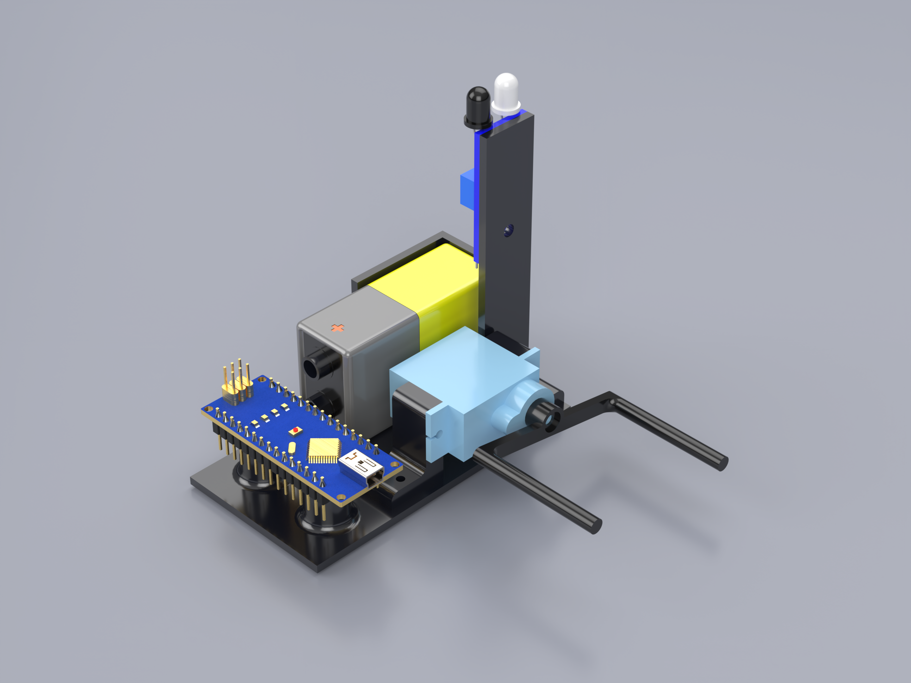

# Automatic Light

## Overview
**Automatic Light** is a simple project that automatically turns a light switch on or off. The system detects whether a person is present using an IR sensor and actuates a servo to switch the switch on or off, reducing power consumption.

---

## Hardware Requirements
- 3D Printer
- Allen Keys
- Screwdriver
---

## Software Requirements
- VSCode
- PlatformIO extension
- CPP extensions
OR
- Ardunio IDE
---

## Assembly Instructions
1. Purchase all components within the [BOM sheet](docs/BOM.pdf). 
2. 3D print all required STL files.
3. Refer to the [assembly document](docs/assembly_document.pdf) to physically assemble the project.
4. Upload the Arduino sketch to the board using the Arduino IDE.

---

## Wiring Diagram
Refer to the [wiring diagram](docs/WiringDiagram.pdf) for proper pin connections between the Arduino, sensor, and actuator.

---

## Usage
1. Place the system in the desired room, next to the light switch.
2. When occupant enters the room, the light will automatically turn on.
3. When occupant leaves the room, the light will automatically turn off. 

A demonstration video of the system in operation is available [here](https://example.com/demo-video).

---

## Configuration
You can adjust the following parameters in the Arduino code:
- Servo angle
- Delay before turning lights off

---

## Future Improvements
- Disable or power down the servo motor when not actively in use
- Integrate wireless control (Wi-Fi or Bluetooth)

---

## Contributing
Contributions are welcome. Please:
1. Fork the repository
2. Create a feature branch
3. Commit your changes with clear messages
4. Submit a pull request

---

## License
This project is licensed under the MIT License. See the `LICENSE` file for details.

